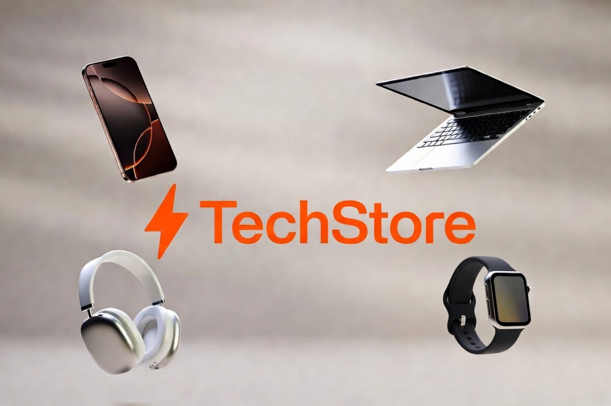

<p align="center">
  
</p>

<p align="center">
  <strong>Uma vitrine moderna de e-commerce para produtos de tecnologia</strong><br>
  Projeto frontend desenvolvido com HTML5, CSS3 e JavaScript puro (Vanilla JS).
</p>

---

## 🚀 Sobre o Projeto

O **TechStore** é um e-commerce fictício de produtos tecnológicos desenvolvido para demonstrar habilidades em desenvolvimento frontend moderno.  

O projeto apresenta uma interface clean, interativa e responsiva, com busca em tempo real e filtro por categorias — tudo feito sem o uso de frameworks ou bibliotecas externas.

**Live Demo:** [Ver projeto online](https://ecommerce-gamma-ashen-53.vercel.app)

---

## ✨ Principais Funcionalidades

- Busca em tempo real com filtro instantâneo
- Filtro por categorias (Smartphones, Notebooks, Fones, Acessórios, SmartWatches)
- Design moderno com gradiente no hero e animações suaves nos cards
- Interface totalmente responsiva (desktop e mobile)
- Renderização dinâmica de produtos via JavaScript

---

## 🛠️ Tecnologias Utilizadas

<image-card alt="HTML5" src="https://img.shields.io/badge/HTML5-E34F26?style=for-the-badge&logo=html5&logoColor=white" ></image-card>
<image-card alt="CSS3" src="https://img.shields.io/badge/CSS3-1572B6?style=for-the-badge&logo=css3&logoColor=white" ></image-card>
<image-card alt="JavaScript" src="https://img.shields.io/badge/JavaScript-F7DF1E?style=for-the-badge&logo=javascript&logoColor=black" ></image-card>

- **HTML5** — Estrutura semântica
- **CSS3** — Flexbox, Grid, CSS Variables e animações
- **JavaScript Vanilla** — DOM manipulation, filtros avançados e interatividade
- **Font Awesome** — Ícones
- **Unsplash** — Imagens dos produtos

---

## 🎯 Habilidades Demonstradas

- Desenvolvimento de interfaces interativas sem frameworks
- Manipulação eficiente do DOM e performance em filtros
- Criação de design responsivo e atrativo
- Organização clara de código (separação de responsabilidades)
- Atenção a UX/UI (hover effects, transições e feedback visual)

---

## 👤 Contribuidores

<table>
  <tr>
    <td align="center">
      <a href="https://github.com/LharaRaysa" target="_blank">
        
        <br/>
        <sub><b>Lhara Raysa</b></sub>
      </a>
    </td>
  </tr>
</table>

---

## 🚀 Como Executar Localmente

1. Clone o repositório:
   ```bash
   git clone https://github.com/LharaRaysa/ecommerce.git
2. Abra a pasta do projeto no seu editor favorito.
3. Execute o arquivo `index.html` diretamente no navegador ou utilize a extensão **Live Server** (VS Code).

---

## 📋 Documentos/Links

- [Documentação completa do projeto](/docs/doc_completo_projeto.md)

---

## 💡 Próximos Passos / Roadmap

- Formatação brasileira de preços (R$ 7.999,00) e exibição de descontos
- Modal de detalhes do produto
- Carrinho de compras com `localStorage`
- Animação de "Adicionar ao carrinho"
- Dark mode
- Melhorias de acessibilidade (ARIA attributes)

---

## 📄 Licença

Este projeto foi criado para fins educacionais e de portfólio.  
Fique à vontade para estudar, clonar e usar como referência em seus próprios projetos.
